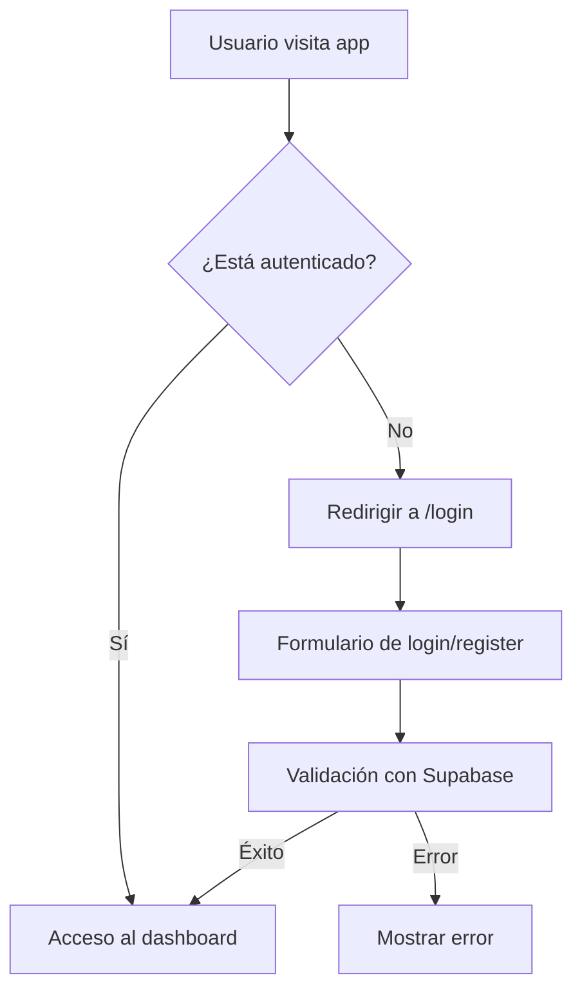
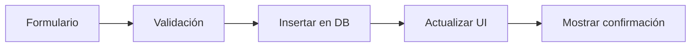
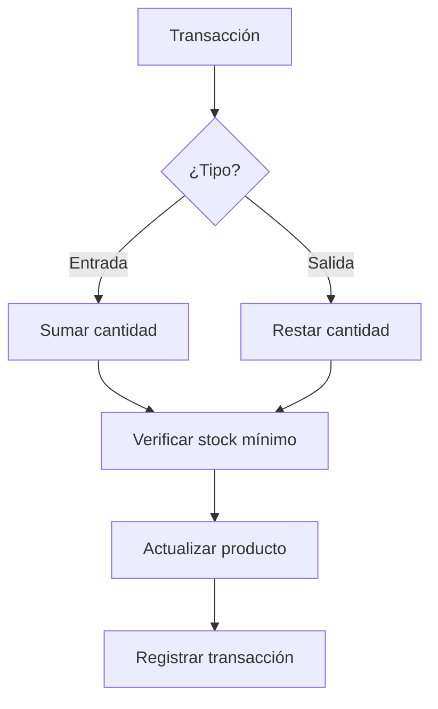

# 📋 Lógica de Funcionamiento - Sistema de Inventario SouthGenetics

## 🎯 **Visión General**

El sistema de inventario de SouthGenetics es una aplicación web completa que permite gestionar el inventario de una empresa de manera eficiente y segura. La aplicación está diseñada con una arquitectura moderna, escalable y centrada en la experiencia del usuario.

---

## 🏗️ **Arquitectura del Sistema**

### **Frontend (Next.js 14)**
- **Framework**: Next.js con App Router
- **Lenguaje**: TypeScript para type safety
- **Estilos**: Tailwind CSS v4 con estilos inline para consistencia
- **Autenticación**: Supabase Auth SSR
- **Estado**: React Hooks (useState, useEffect)

### **Backend (Supabase)**
- **Base de datos**: PostgreSQL
- **Autenticación**: Supabase Auth
- **API**: Supabase Client/Server
- **Seguridad**: Row Level Security (RLS)
- **Tiempo real**: Suscripciones en tiempo real

---

## 🔐 **Sistema de Autenticación**

### **Flujo de Autenticación**



### **Protección de Rutas**
- **Middleware**: Verifica autenticación en cada request
- **Rutas protegidas**: `/dashboard/*`
- **Rutas públicas**: `/login`, `/register`
- **Redirección automática**: Usuarios no autenticados → `/login`

### **Gestión de Sesiones**
- **Cookies seguras**: Manejo con `getAll`/`setAll`
- **Refresh automático**: Tokens se renuevan automáticamente
- **Logout**: Limpia sesión y redirige a login

---

## 📊 **Gestión de Datos**

### **Entidades Principales**

#### **1. Usuarios (users)**
```typescript
interface User {
  id: string
  email: string
  name: string
  created_at: string
  updated_at: string
}
```

#### **2. Categorías (categories)**
```typescript
interface Category {
  id: string
  name: string
  description: string
  color: string
  created_at: string
  updated_at: string
}
```

#### **3. Proveedores (suppliers)**
```typescript
interface Supplier {
  id: string
  name: string
  email: string
  phone: string
  address: string
  created_at: string
  updated_at: string
}
```

#### **4. Productos (products)**
```typescript
interface Product {
  id: string
  sku: string
  name: string
  description: string
  category: string
  quantity: number
  min_quantity: number
  unit_price: number
  unit_currency: 'USD' | 'UYU'
  supplier: string
  location: string
  created_at: string
  updated_at: string
  created_by: string
}
```

#### **5. Empleados (employees)**
```typescript
interface Employee {
  id: string
  name: string
  surname: string
  created_at: string
  updated_at: string
}
```

#### **6. Asignaciones de Productos (product_assignments)**
```typescript
interface ProductAssignment {
  id: string
  product_id: string
  employee_id: string
  quantity: number
  assigned_at: string
  product?: Product
  employee?: Employee
}
```
  description: string
  category_id: string
  supplier_id: string
  quantity: number
  min_quantity: number
  unit_price: number
  created_at: string
  updated_at: string
}
```

#### **5. Transacciones (transactions)**
```typescript
interface Transaction {
  id: string
  product_id: string
  type: 'in' | 'out'
  quantity: number
  reason: string
  notes: string
  user_id: string
  created_at: string
}
```

### **Relaciones entre Entidades**
```
Users (1) ←→ (N) Transactions
Categories (1) ←→ (N) Products
Suppliers (1) ←→ (N) Products
Products (1) ←→ (N) Transactions
```

---

## 🔄 **Flujo de Operaciones**

### **1. Gestión de Productos**

#### **Crear Producto**


#### **Actualizar Stock**


### **2. Sistema de Transacciones**

#### **Entrada de Stock**
- **Trigger automático**: Actualiza `quantity` del producto
- **Validación**: Cantidad positiva
- **Registro**: Crea entrada en tabla `transactions`
- **Notificación**: Alerta si stock bajo

#### **Salida de Stock**
- **Validación**: Stock suficiente disponible
- **Validación en tiempo real**: No permite salidas mayores al stock disponible
- **Trigger automático**: Actualiza `quantity` del producto
- **Registro**: Crea salida en tabla `transactions`
- **Alerta**: Si stock cae bajo mínimo
- **Bloqueo**: Impide salidas cuando stock es 0

### **3. Alertas y Notificaciones**

#### **Stock Bajo**
```typescript
// Lógica de detección
if (product.quantity <= product.min_quantity) {
  // Mostrar alerta en dashboard
  // Enviar notificación
}
```

#### **Stock Crítico**
```typescript
// Stock crítico (0 o negativo)
if (product.quantity <= 0) {
  // Alerta urgente
  // Bloquear salidas
}
```

#### **Alertas en Dashboard**
```typescript
// Sección de alertas de stock bajo
{lowStockProducts.length > 0 && (
  <div className="low-stock-alerts">
    {lowStockProducts.map(product => (
      <AlertCard 
        product={product}
        type="critical"
        message={`Stock actual: ${product.quantity} | Mínimo: ${product.min_quantity}`}
      />
    ))}
  </div>
)}
```

### **4. Validaciones de Entrada**

#### **Inputs Numéricos**
```typescript
// Solo enteros positivos
onChange={(e) => {
  const value = Math.floor(Number(e.target.value))
  setValue(value >= 0 ? value : 0)
}}
onKeyDown={(e) => {
  if (e.key === 'e' || e.key === 'E' || e.key === '+' || e.key === '-') {
    e.preventDefault()
  }
}}
```

#### **Validación de Stock**
```typescript
// Para salidas de stock
if (quantity > availableStock) {
  // Mostrar error
  // Deshabilitar botón
}
```

#### **Precio Unitario y Moneda**
```typescript
// Campo de precio entero con selección de moneda
<div style={{ display: 'flex', gap: '0.5rem' }}>
  <input
    type="number"
    step="1"
    value={formData.unit_price}
    onChange={(e) => {
      const value = Math.floor(Number(e.target.value))
      setFormData({ ...formData, unit_price: value >= 0 ? value : 0 })
    }}
    style={{ WebkitAppearance: 'none', MozAppearance: 'textfield' }}
  />
  <select
    value={formData.unit_currency}
    onChange={(e) => setFormData({ ...formData, unit_currency: e.target.value })}
  >
    <option value="USD">USD</option>
    <option value="UYU">Pesos Uruguayos</option>
  </select>
</div>
```

---

## 📈 **Dashboard y Estadísticas**

### **Métricas Principales**

#### **1. Resumen General**
- **Total de productos**: Contador de productos activos
- **Stock bajo**: Productos con cantidad ≤ mínimo
- **Valor total**: Suma de (cantidad × precio unitario)
- **Transacciones recientes**: Últimas 5 transacciones

#### **2. Gráficos y Tendencias**
- **Movimiento de stock**: Entradas vs salidas por período
- **Productos más vendidos**: Ranking por transacciones
- **Valor del inventario**: Evolución temporal

### **Cálculo de Estadísticas**
```sql
-- Función para estadísticas del dashboard
CREATE OR REPLACE FUNCTION get_dashboard_stats()
RETURNS TABLE (
  total_products bigint,
  low_stock_count bigint,
  total_value numeric,
  recent_transactions json
) AS $$
BEGIN
  RETURN QUERY
  SELECT 
    COUNT(p.id)::bigint,
    COUNT(CASE WHEN p.quantity <= p.min_quantity THEN 1 END)::bigint,
    COALESCE(SUM(p.quantity * p.unit_price), 0),
    COALESCE(
      (SELECT json_agg(t.*) 
       FROM (
         SELECT t.*, p.name as product_name
         FROM transactions t
         JOIN products p ON t.product_id = p.id
         ORDER BY t.created_at DESC
         LIMIT 5
       ) t
      ), '[]'::json
    )
  FROM products p;
END;
$$ LANGUAGE plpgsql;
```

---

## 🔒 **Seguridad y Permisos**

### **Row Level Security (RLS)**

#### **Políticas por Tabla**

**Users**
```sql
-- Usuarios solo pueden ver su propia información
CREATE POLICY "Users can view own data" ON users
  FOR SELECT USING (auth.uid() = id);
```

**Products**
```sql
-- Usuarios autenticados pueden gestionar productos
CREATE POLICY "Authenticated users can manage products" ON products
  FOR ALL USING (auth.role() = 'authenticated');
```

**Transactions**
```sql
-- Usuarios pueden ver todas las transacciones
CREATE POLICY "Authenticated users can view transactions" ON transactions
  FOR SELECT USING (auth.role() = 'authenticated');

-- Usuarios pueden crear transacciones
CREATE POLICY "Authenticated users can create transactions" ON transactions
  FOR INSERT WITH CHECK (auth.role() = 'authenticated');
```

### **Validaciones del Cliente**
- **Formularios**: Validación en tiempo real
- **Permisos**: Verificación antes de operaciones
- **Sanitización**: Limpieza de datos de entrada

---

## 🎨 **Interfaz de Usuario**

### **Diseño y UX**

#### **Paleta de Colores**
- **Primario**: Mostaza (`rgb(218, 165, 32)`)
- **Secundario**: Verde oliva (`rgb(128, 128, 0)`)
- **Neutros**: Grises y blancos
- **Estados**: Verde (éxito), rojo (error), amarillo (advertencia)

#### **Componentes Reutilizables**
- **Button**: Variantes (primary, secondary, danger, success)
- **Modal**: Para formularios y confirmaciones
- **LoadingSpinner**: Estados de carga
- **Card**: Contenedores de información

#### **Micro-animaciones**
- **Hover effects**: Escala y cambio de color
- **Transiciones**: Suaves y fluidas
- **Feedback visual**: Confirmaciones y errores

### **Responsive Design**
- **Desktop**: Sidebar fijo, layout completo
- **Tablet**: Sidebar colapsable
- **Mobile**: Sidebar overlay, botón de menú

---

## 🔄 **Flujo de Datos**

### **1. Lectura de Datos**
```typescript
// Hook personalizado para datos
const { data, loading, error } = useSupabase({
  table: 'products',
  select: '*',
  filters: { category_id: selectedCategory },
  order: { column: 'name', ascending: true }
});
```

### **2. Escritura de Datos**
```typescript
// Crear nuevo producto
const { data, error } = await useSupabase({
  table: 'products',
  action: 'create',
  data: productData
});
```

### **3. Actualizaciones en Tiempo Real**
```typescript
// Suscripción a cambios
const subscription = supabase
  .channel('products')
  .on('postgres_changes', 
    { event: '*', schema: 'public', table: 'products' },
    (payload) => {
      // Actualizar UI
    }
  )
  .subscribe();
```

---

## 🚀 **Optimizaciones y Performance**

### **1. Caching**
- **React Query**: Cache de datos del servidor
- **Local Storage**: Preferencias del usuario
- **Session Storage**: Datos temporales

### **2. Lazy Loading**
- **Componentes**: Carga bajo demanda
- **Imágenes**: Optimización automática
- **Rutas**: Code splitting automático

### **3. Optimizaciones de Base de Datos**
- **Índices**: En campos de búsqueda frecuente
- **Vistas**: Para consultas complejas
- **Triggers**: Para cálculos automáticos

---

## 📱 **Funcionalidades por Módulo**

### **Dashboard**
- ✅ Resumen de métricas
- ✅ Acciones rápidas
- ✅ Actividad reciente
- ✅ Alertas de stock

### **Productos**
- ✅ CRUD completo
- ✅ Búsqueda y filtros
- ✅ Gestión de stock
- ✅ Entrada y salida de stock
- ✅ Validación de stock disponible
- ✅ Historial de transacciones
- ✅ Inputs numéricos solo enteros

### **Categorías**
- ✅ CRUD completo
- ✅ Asignación de colores
- ✅ Estadísticas por categoría

### **Transacciones**
- ✅ Registro de entradas/salidas
- ✅ Razones y notas
- ✅ Historial completo
- ✅ Exportación de datos

### **Proveedores**
- ✅ CRUD completo
- ✅ Información de contacto
- ✅ Productos asociados

### **Empleados**
- ✅ CRUD completo (nombre y apellido)
- ✅ Asignación de productos
- ✅ Gestión de asignaciones
- ✅ Vista de productos por empleado
- ✅ Remoción de asignaciones

### **Solicitudes de Stock**
- ✅ Creación de solicitudes por empleados
- ✅ Solicitudes para productos existentes o nuevos objetos
- ✅ Sistema de prioridades (baja, media, alta, urgente)
- ✅ Estados de solicitud (pendiente, aprobada, rechazada, completada)
- ✅ Gestión completa de solicitudes
- ✅ Cambio de estado en tiempo real
- ✅ Validación de campos obligatorios

---

## 👥 **Gestión de Empleados**

### **Funcionalidades Principales**

#### **1. Creación de Empleados**
```typescript
// Formulario simple con nombre y apellido
const employeeData = {
  name: string,
  surname: string
}
```

#### **2. Asignación de Productos**
```typescript
// Modal de asignación
const assignmentData = {
  product_id: string,
  quantity: number
}

// Validación
if (quantity > product.stock) {
  // Error: Stock insuficiente
}
```

#### **3. Vista de Asignaciones**
```typescript
// Por empleado
const employeeAssignments = assignments.filter(
  assignment => assignment.employee_id === employeeId
)

// Mostrar en cards
{employeeAssignments.map(assignment => (
  <AssignmentCard 
    product={assignment.product}
    quantity={assignment.quantity}
    onRemove={() => handleRemoveAssignment(assignment.id)}
  />
))}
```

#### **4. Gestión de Asignaciones**
- **Crear**: Asignar producto a empleado
- **Ver**: Lista de productos por empleado
- **Remover**: Eliminar asignación específica
- **Validación**: Stock disponible para asignación

---

## 📋 **Solicitudes de Stock**

### **Funcionalidades Principales**

#### **1. Creación de Solicitudes**
```typescript
// Formulario de solicitud
const requestData = {
  employee_id: string,        // Empleado solicitante
  product_name: string,       // Nombre del producto/objeto
  product_id?: string,        // ID del producto existente (opcional)
  quantity: number,           // Cantidad solicitada
  priority: 'baja' | 'media' | 'alta' | 'urgente',
  reason: string,             // Razón de la solicitud
  notes?: string              // Notas adicionales
}
```

#### **2. Estados de Solicitud**
```typescript
// Estados disponibles
type RequestStatus = 'pendiente' | 'aprobada' | 'rechazada' | 'completada'

// Cambio de estado
const handleStatusChange = async (requestId: string, newStatus: RequestStatus) => {
  await supabase
    .from('stock_requests')
    .update({ status: newStatus })
    .eq('id', requestId)
}
```

#### **3. Gestión de Solicitudes**
```typescript
// Vista de tabla con filtros visuales
{requests.map(request => (
  <RequestRow
    key={request.id}
    request={request}
    onStatusChange={(status) => handleStatusChange(request.id, status)}
    onEdit={() => handleEdit(request)}
    onDelete={() => handleDelete(request.id)}
  />
))}
```

#### **4. Flujo de Trabajo**
1. **Empleado crea solicitud**: Completa formulario con detalles
2. **Administrador revisa**: Ve solicitudes pendientes en tabla
3. **Administrador actúa**: Aprueba, rechaza o completa solicitud
4. **Seguimiento**: Historial completo de cambios de estado

#### **5. Características Especiales**
- **Productos existentes**: Opción de seleccionar producto del inventario
- **Nuevos objetos**: Solicitar objetos que no existen en el inventario
- **Prioridades visuales**: Colores diferenciados por urgencia
- **Estados dinámicos**: Cambio de estado en tiempo real
- **Validación completa**: Cantidad mínima, campos obligatorios

#### **6. Filtrado y Ordenamiento**
```typescript
// Filtros disponibles
const filters = {
  priority: 'urgente' | 'alta' | 'media' | 'baja',
  employee: 'employee_id',
  status: 'pendiente' | 'aprobada' | 'rechazada' | 'completada'
}

// Ordenamiento
const sortOptions = {
  by: 'requested_at' | 'priority' | 'employee',
  order: 'asc' | 'desc'
}
```

---

## 📊 **Filtrado y Ordenamiento**

### **Solicitudes de Stock**

#### **Filtros Disponibles**
- **Por Prioridad**: Urgente, Alta, Media, Baja
- **Por Empleado**: Filtrar por empleado específico
- **Por Estado**: Pendiente, Aprobada, Rechazada, Completada

#### **Ordenamiento**
- **Por Fecha**: Más reciente a más antigua y viceversa
- **Por Prioridad**: Urgente → Alta → Media → Baja
- **Por Empleado**: Orden alfabético por nombre

#### **Interfaz de Usuario**
```typescript
// Controles de filtrado
<div className="filters">
  <select value={filters.priority} onChange={handlePriorityFilter}>
    <option value="">Todas las prioridades</option>
    <option value="urgente">Urgente</option>
    <option value="alta">Alta</option>
    <option value="media">Media</option>
    <option value="baja">Baja</option>
  </select>
  
  <select value={filters.employee} onChange={handleEmployeeFilter}>
    <option value="">Todos los empleados</option>
    {employees.map(emp => (
      <option key={emp.id} value={emp.id}>
        {emp.name} {emp.surname}
      </option>
    ))}
  </select>
  
  <select value={filters.status} onChange={handleStatusFilter}>
    <option value="">Todos los estados</option>
    <option value="pendiente">Pendiente</option>
    <option value="aprobada">Aprobada</option>
    <option value="rechazada">Rechazada</option>
    <option value="completada">Completada</option>
  </select>
</div>
```

### **Transacciones**

#### **Filtros Disponibles**
- **Por Tipo**: Entrada o Salida
- **Por Producto**: Filtrar por producto específico

#### **Ordenamiento**
- **Por Fecha**: Más reciente a más antigua y viceversa
- **Por Producto**: Orden alfabético por nombre
- **Por Tipo**: Entrada/Salida

#### **Interfaz de Usuario**
```typescript
// Controles de filtrado para transacciones
<div className="transaction-filters">
  <select value={filters.type} onChange={handleTypeFilter}>
    <option value="">Todos los tipos</option>
    <option value="in">Entrada</option>
    <option value="out">Salida</option>
  </select>
  
  <select value={filters.product} onChange={handleProductFilter}>
    <option value="">Todos los productos</option>
    {products.map(product => (
      <option key={product.id} value={product.id}>
        {product.name} ({product.sku})
      </option>
    ))}
  </select>
</div>
```

#### **Resumen de Resultados**
```typescript
// Mostrar estadísticas de filtrado
<div className="results-summary">
  <span>Mostrando {filteredCount} de {totalCount} registros</span>
  {hasFilters && <span className="filtered-indicator">(filtrados)</span>}
  <span>Ordenado por: {sortField} ({sortOrder})</span>
</div>
```

#### **Limpieza de Filtros**
```typescript
const clearFilters = () => {
  setFilters({
    priority: '',
    employee: '',
    status: ''
  })
  setSortBy('requested_at')
  setSortOrder('desc')
}
```

---

## 🔧 **Configuración y Despliegue**

### **Variables de Entorno**
```env
NEXT_PUBLIC_SUPABASE_URL=your_supabase_url
NEXT_PUBLIC_SUPABASE_ANON_KEY=your_supabase_anon_key
SUPABASE_SERVICE_ROLE_KEY=your_service_role_key
```

### **Base de Datos**
- **Script de setup**: `database.sql`
- **Datos iniciales**: Categorías y proveedores de ejemplo
- **Políticas RLS**: Configuradas automáticamente

### **Despliegue**
- **Vercel**: Recomendado para Next.js
- **Netlify**: Alternativa
- **Supabase**: Hosting de base de datos

---

## 🐛 **Manejo de Errores**

### **Tipos de Errores**
1. **Errores de autenticación**: Redirección a login
2. **Errores de validación**: Mensajes en formularios
3. **Errores de red**: Reintentos automáticos
4. **Errores de base de datos**: Logs y notificaciones

### **Estrategias de Recuperación**
- **Retry automático**: Para errores temporales
- **Fallback UI**: Estados de error elegantes
- **Logging**: Registro de errores para debugging

---

## 📈 **Escalabilidad**

### **Arquitectura Escalable**
- **Microservicios**: Preparado para separación
- **API REST**: Endpoints bien definidos
- **Base de datos**: Optimizada para crecimiento
- **CDN**: Para assets estáticos

### **Consideraciones Futuras**
- **Multi-tenant**: Soporte para múltiples empresas
- **API pública**: Para integraciones externas
- **Mobile app**: React Native
- **Reportes avanzados**: Business Intelligence

---

## 🎯 **Conclusión**

El sistema de inventario de SouthGenetics está diseñado para ser:

✅ **Robusto**: Manejo de errores y validaciones  
✅ **Escalable**: Arquitectura preparada para crecimiento  
✅ **Seguro**: Autenticación y autorización robustas  
✅ **Intuitivo**: UX centrada en el usuario  
✅ **Eficiente**: Optimizaciones de performance  
✅ **Mantenible**: Código limpio y documentado  

La aplicación proporciona una solución completa para la gestión de inventario, desde la autenticación de usuarios hasta el análisis de datos, todo integrado en una interfaz moderna y fácil de usar. 